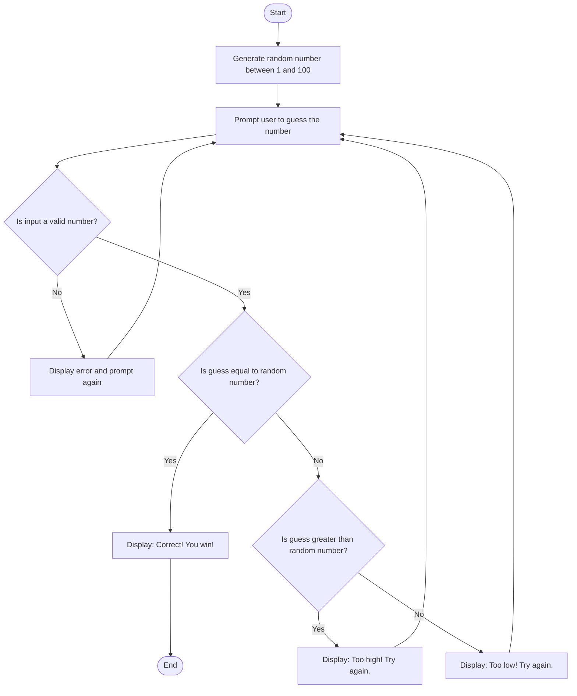

### Guessing Numbers

## How to play

### 1. Start
The game begins.

### 2. Generate Random Number
A random number is generated between 1 and 100 (inclusive). This is the target number the user must guess.

### 3. Prompt User for a Guess
The program asks the user to input a number.

### 4. Validate Input
The input is checked to ensure it's a valid numeric value.

- If it's **not valid**:  
  The user is shown an error message (e.g., *"Invalid input. Please enter a number."*) and prompted again.

### 5. Compare Guess to the Random Number
Once a valid number is entered:

- If it **matches** the random number, the user wins.
- If it is **greater than** the random number, the user is told it's **"Too high!"** and prompted again.
- If it is **less than** the random number, the user is told it's **"Too low!"** and prompted again.

### 6. Repeat Until Correct
The process loops until the user guesses the correct number.

### 7. End
Once the correct guess is made, the game ends.

