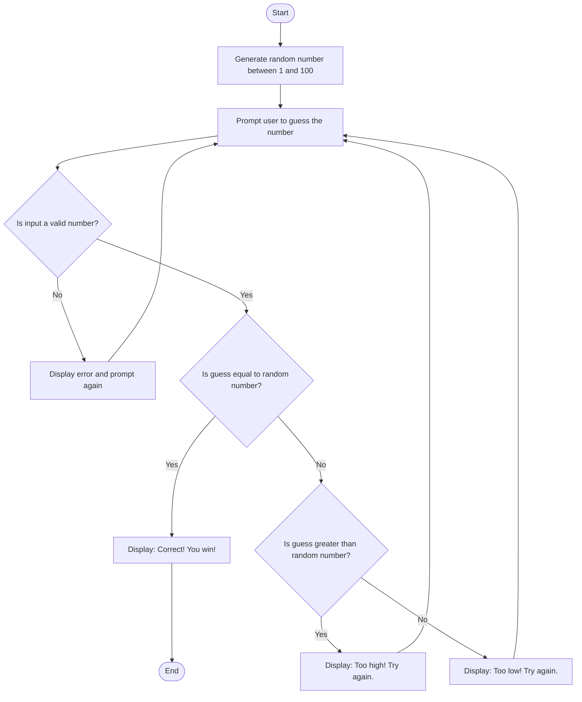

## Guessing Numbers

```mermaid
flowchart TD
    Start([Start]) --> Init["Generate random number between 1 and 100"]
    Init --> PromptInput["Prompt user to guess the number"]
    PromptInput --> ValidateInput{"Is input a valid number?"}
    ValidateInput -- No --> InvalidInput["Display error and prompt again"] --> PromptInput
    ValidateInput -- Yes --> CheckGuess{"Is guess equal to random number?"}
    CheckGuess -- Yes --> Correct["Display: Correct! You win!"] --> End([End])
    CheckGuess -- No --> CompareGuess{"Is guess greater than random number?"}
    CompareGuess -- Yes --> TooHigh["Display: Too high! Try again."] --> PromptInput
    CompareGuess -- No --> TooLow["Display: Too low! Try again."] --> PromptInput
```

